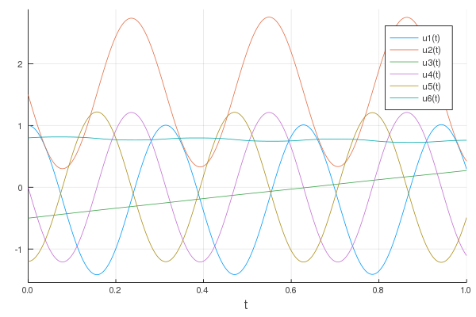

# Charged particle

A system of charged particles under the effect of an external electro-magnetic field is considered to be 
$(E(t, x), B(t, x))\in \mathbb{R}^6$.\
Particles are dynamically described by their position 
$x(t)\in\mathbb{R}^3$ and their speed $v(t)\in\mathbb{R}^3$. We'll index by $i$ the $i$-th component of a vector.
Newton's equations applied to a particle can be written as

$$\begin{aligned}
\frac{d x(t) }{dt}&= v(t) \\
\frac{d v(t) }{dt}&= \frac{e}{m} \left[E(t, x(t)) + v(t)\times B(t, x(t))\right]. 
\end{aligned}$$

We will assume that the magnetic field is written $B(t, x)=(0, 0, 1)^T$ and under a certain scaling, we consider the following equation

$$\begin{aligned}
\frac{d x_1(t) }{dt} &= \frac{1}{\varepsilon}v_1(t) \\
\frac{d x_2(t) }{dt} &= \frac{1}{\varepsilon} v_2(t) \\
\frac{d x_3(t) }{dt} &= v_3(t) \\
\frac{d v_1(t) }{dt} &= E_1(t, x(t)) + \frac{1}{\varepsilon}v_2(t)\\
\frac{d v_2(t) }{dt} &= E_2(t, x(t)) - \frac{1}{\varepsilon}v_1(t)\\
\frac{d v_3(t) }{dt} &= E_3(t, x(t)) 
\end{aligned}$$

which is rewritten as follows

$$\frac{d u(t) }{dt}= \frac{1}{\varepsilon}A u(t) + F(t, u(t)),$$

where the unknown vector $u(t)=(x(t), v(t))\in\mathbb{R}^6$, $A$ is a square matrix of size $6\times 6$
and $F$ is a function with a value in $\mathbb{R}^6$. $A$ and $F$ are given by

$$A=
\left(
\begin{array}{cccccc}
0 & 0 & 0 & 1 & 0 & 0 \\
0 & 0 & 0 & 0 & 1 & 0 \\
0 & 0 & 0 & 0 & 0 & 0 \\
0 & 0 & 0 & 0 & 1 & 0 \\
0 & 0 & 0 & -1 & 0 & 0 \\
0 & 0 & 0 & 0 & 0 & 0 
\end{array}
\right) \;\;\;\; \text{ and } \;\;\;\;
F(t, u(t)) = \left(
\begin{array}{cccccc}
0 \\
0\\
u_6(t)\\
E_1(t, u_1(t), u_2(t), u_3(t))\\
E_2(t,  u_1(t), u_2(t), u_3(t)\\
E_3(t,  u_1(t), u_2(t), u_3(t)
\end{array}
\right).$$

We can consider the following $E=(E_1, E_2, E_3)$ function

$$E(t, x) =
\left(
\begin{array}{ccc}
\cos(x_1/2)\sin(x_2)\sin(x_3)/2\\
\sin(x_1/2)\cos(x_2)\sin(x_3)\\
\sin(x_1/2)\sin(x_2)\cos(x_3)
\end{array}
\right)$$

```jl
using HiOscSolver
A = [0 0 0 1 0 0; 0 0 0 0 1 0;0 0 0 0 0 0; 0 0 0 0 1 0; 0 0 0 -1 0 0; 0 0 0 0 0 0]
function fparticle(u, p, t)
    s1, c1 = sincos(u[1]/2)
    s2, c2 = sincos(u[2])
    s3, c3 = sincos(u[3])
    return [0, 0, u[6], c1*s2*s3/2, s1*c2*s3, s1*s2*c3]
end
epsilon= 0.05
t_min=0.0
t_max=1.0
u0 = [1.0, 1.5, -0.5, 0, -1.2, 0.8]
prob = HiOscODEProblem(fparticle, u0, (t_min,t_max), missing, A, epsilon)
sol=solve(prob)
plot(sol)
```


