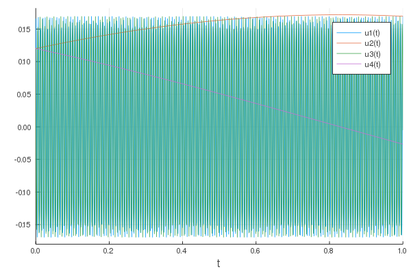

# Hénon-Heiles Example

We consider the system of Hénon-Heiles satisfied by $u(t)=(u_1, u_2, u_3, u_4)(t)$.

$$\frac{d u }{dt} = \frac{1}{\varepsilon} Au + f(u), \;\;\; u(0)=u_0\in\mathbb{R}^4,$$

where $A$ and $f$ are selected as follows

$$A=
\left(
\begin{array}{cccc}
0 & 0 & 1 & 0  \\
0 & 0 & 0 & 0  \\
-1 & 0 & 0 & 0  \\
0 & 0 & 0 & 0  
\end{array}
\right) \;\;\;\; \text{ and } \;\;\;\;
f(u) = \left(
\begin{array}{cccc}
0 \\
u_4\\
-2 u_1 u_2\\
-u_2-u_1^2+u_2^2
\end{array}
\right).$$

one chooses for example, $\varepsilon=0.001$
and $u_0 = (0.12, 0.12, 0.12, 0.12)$
```jl
using HiOscSolver
A=[0 0 1 0 ; 0 0 0 0 ; -1 0 0 0 ; 0 0 0 0]
fct = (u,p,t) ->  [ 0, u[4], 2*u[1]*u[2], -u[2] - u[1]^2 + u[2]^2 ] 
epsilon= 0.001
t_min=0.0
t_max=1.0
u0 = [0.12, 0.12, 0.12, 0.12]
prob = HiOscODEProblem(fct, u0, (t_min,t_max), missing, A, epsilon)
sol = solve(prob);
using Plots
plot(sol)
```



